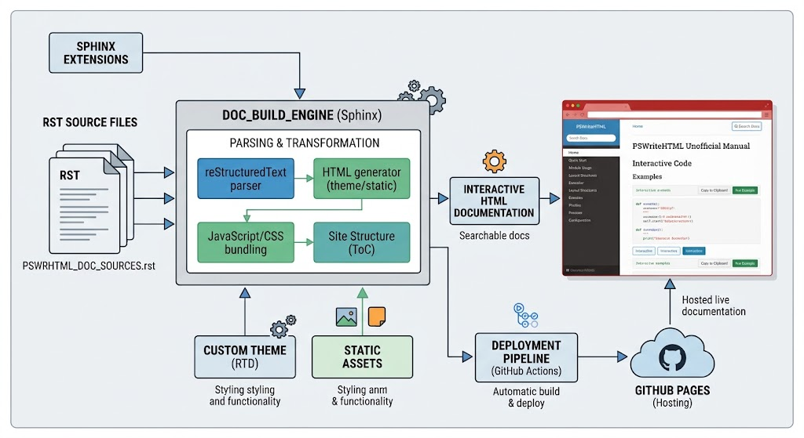

# 📚 PSWriteHTML unofficial manual

Hey there! 👋 Welcome to the unofficial manual for [**PSWriteHTML**](https://github.com/EvotecIT/PSWriteHTML) by **Przemysław Kłys** ([Evotec](https://github.com/EvotecIT)).

You can view the live interactive documentation right here:

👉 [**https://nicozanf.github.io/PSWriteHTML-doc**](https://nicozanf.github.io/PSWriteHTML-doc)

There is also a [**blog post**](https://nicozanf.wordpress.com/2026/09/29/from-learning-to-contributing-building-interactive-docs-for-pswritehtml/)

---

⭐ **If you find this documentation useful, please consider giving the repository a star!** It helps others discover the project and keeps the momentum going!

---

## 🧠 Inspiration & Philosophy

If you’ve ever had to document a massive library or module, you know the pain: traditional documentation setups break content into dozens of nested subpages. You end up clicking through endless sidebars, waiting for pages to load, and losing context just to find a single description.

This repository builds upon:

* The fantastic workflow guide by **Michael Altfield** on [building Sphinx/RTD docs hosted via GitHub Pages](https://tech.michaelaltfield.net/2020/07/18/sphinx-rtd-github-pages-1/).
* My previous adaptation of that workflow for the [**py4web-doc**](https://github.com/nicozanf/py4web-doc) project.

Instead of navigating through fragmented pages, this project packages the entire PSWriteHTML reference into a fast, single-page, searchable HTML interface! 🚀

---

## ⚡ Why this beats the classic ReadTheDocs setup

| Feature | Classic ReadTheDocs / Multi-Page | This PSWriteHTML Doc |
| :--- | :--- | :--- |
| **Navigation** | Deeply nested page trees (lots of clicking) | **Single-page experience** (everything in one place) |
| **Search** | Multi-page server/index lookups | **Instant client-side filtering** as you type |
| **Offline Usage** | Requires complex builds or exports | **100% Portable** (standalone HTML/JS file) |
| **CI/CD Integration** | External service hooks or webhooks | Integrated **GitHub Actions** pipeline |
| **Reading Flow** | Fragmented across individual files | Seamless scrolling with sticky table of contents |

---

## ⚙️ Automated GitHub Actions Workflow

You don't need to manually update static files when changing documentation.

This repository uses **GitHub Actions** to automatically build and publish the documentation on every Pull Request and commit push.

* **Pull Requests:** Trigger automated build tests to make sure everything compiles cleanly before merging.
* **Main Branch:** Automatically deploys the rendered output directly to **GitHub Pages** at `https://nicozanf.github.io/PSWriteHTML-doc`.



---

## 🛠️ Local Development & Building

Want to tweak the docs or test changes locally before opening a PR?

1. **Clone the repo:**
   ```bash
   git clone https://github.com/nicozanf/PSWriteHTML-doc.git
   cd PSWriteHTML-doc
   ```

2. **Install PSWriteHTML (if you haven't already):**
   ```powershell
   Install-Module -Name PSWriteHTML -Force
   ```

3. **Run the local generator:**
   ```powershell
   .\Build-Docs.ps1
   ```

   Open the generated HTML file in your browser to inspect your changes!

---

## 🤝 Contributing

Spotted a typo, broken section, or missing cmdlet example? Pull requests are super welcome! Open an issue or send over a PR to help keep these docs up to date.

---

*Created with ❤️ for the PowerShell community. Special thanks to **Przemysław Kłys** ([Evotec](https://github.com/EvotecIT)) for creating [PSWriteHTML](https://github.com/EvotecIT/PSWriteHTML).*


