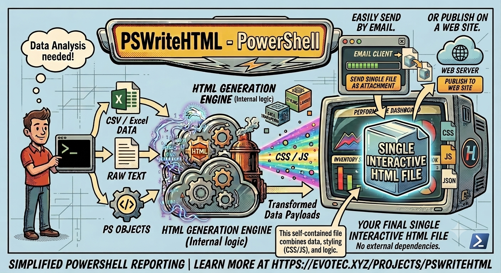
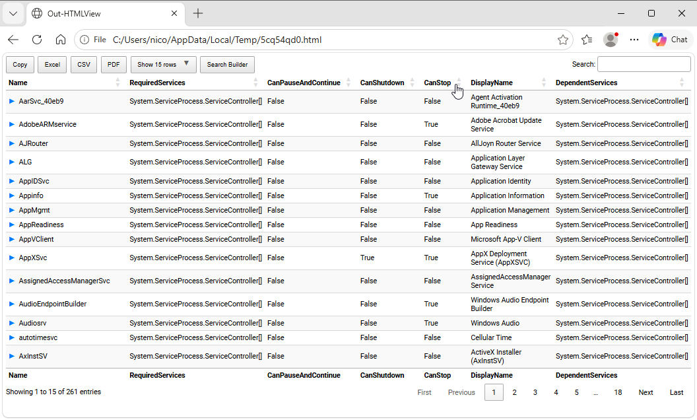

===============================
Chapter 1: What is PSWriteHTML?
===============================

.. contents:: Table of Contents
   :local:
   :depth: 2

About this manual
=================

This manual is designed to help you quickly understand the capabilities of PSWriteHTML and how to implement it in your PowerShell scripts.
Each chapter provides practical examples, best practices, and detailed explanations of the module's features.

Nico Zanferrari (https://github.com/nicozanf) assembled it, after reading all the available documentations - mainly from the author
Przemysław Kłys (EvotecIT) - see the last chapter for a list of sources, including video tutorials.  Surely AI made a lot of work, but most of the
results were manually refined and carefully reviewed. Nowadays it is maintained as an open-source
project on GitHub at https://github.com/nicozanf/PSWriteHTML-doc . The resulting web manual
is automatically generated from the repository on https://nicozanf.github.io/PSWriteHTML-doc , along with the pdf version.

Contributions, feedback, and suggestions are always welcome!

PSWriteHTML Overview
====================

**PSWriteHTML** is an open-source PowerShell module created by Przemysław Kłys (`Evotec <https://github.com/EvotecIT>`_) designed
to automate the creation of rich, interactive, and modern HTML documents, reports, dashboards, and emails without requiring manual
HTML, CSS, or JavaScript authoring.

   *PSWriteHTML makes report generation in PowerShell simple, flexible, and visually engaging.*

Why PSWriteHTML?
================

Generating IT reports, audit logs, system health dashboards, or automated client emails often requires presenting complex datasets clearly. PSWriteHTML
bridges the gap between raw data collection in PowerShell and professional presentation.

Key Benefits
------------

* **Zero Web Development Required:** Write pure PowerShell using a declarative Domain-Specific Language (DSL).
* **Interactive Data Representation:** Out-of-the-box support for search, pagination, sorting, and export (PDF, CSV, Excel) powered
  by `DataTables <https://datatables.net/>`_.
* **Rich Visualization:** Integrate interactive charts (bar, line, pie, donut, gauge) powered by `ApexCharts <https://apexcharts.com/>`_ and `Chart.js`.
* **Flexible Layout Systems:** Organize content using tabs, accordions, multi-column panels, grids, and collapsible sections.
* **Network & Flow Diagrams:** Render visual topology, organizational charts, and relational graphs using `Vis Network <https://visjs.org/>`_.
* **Email & Document Ready:** Generate inline CSS emails optimized for Microsoft Outlook or standalone single-file HTML reports.

Native PowerShell includes the ``ConvertTo-Html`` cmdlet, but its output is static, unstyled, and difficult to format. PSWriteHTML
replaces plain text tables with dynamic dashboards featuring interactive tables, real-time charts, tabbed navigation,
collapsible sections, custom styling, and diagramming capabilities.

Common Use Cases
================

1. **Active Directory Auditing:** Reporting on inactive accounts, password expiration dates, and group membership changes.
2. **Infrastructure Monitoring:** Daily health-check summaries for VMware, Hyper-V, Azure resources, or network devices.
3. **Office 365 & Exchange Reports:** Displaying mailbox usage, license allocation, and security compliance scores.
4. **Automated HTML Emails:** Sending formatted, inline-styled alert notifications via SMTP.

.. tip::
   Because PSWriteHTML bundles required JavaScript and CSS libraries into self-contained HTML files (or references CDN sources), the output reports can
   easily be hosted on static web servers, AWS S3, or sent directly as email attachments. See :doc:`Chapter 10: Advanced Features, Tips, and Troubleshooting <chapter-10>`

Quick Start Example
===================

Here is a minimal working example that collects services data from your computer and generates an interactive report saved to disk:

.. code-block:: powershell

   Get-Service -ErrorAction SilentlyContinue | Out-HtmlView

This is an example of the power of PSWriteHTML: with a single command you can transform some data into a beautiful html page, with
pagination, sorting, advanced searching capabilities, and even export in Excel/CSV/PDF !

But this simple *Out-HtmlView* cmdlet in fact is a shortcut for the underlying *New-HTML* command, which allows you to further customize
the report (for example selecting the columns included): 

.. code-block:: powershell

   Import-Module PSWriteHTML # need PSWriteHTML already installed
   
   # Gather services while suppressing permission errors
   $Services = Get-Service -ErrorAction SilentlyContinue | 
       Select-Object -Property Name, DisplayName, Status, StartType
   
   # Generate HTML Report
   New-HTML -Title "Service Status" -Show {
 		New-HTMLTable -DataTable $Services
   }

Core Architecture & DSL Concept
===============================

Component Hierarchy
-------------------

The general layout structure follows a logical container model:

.. code-block:: text

   New-HTML
   ├── New-HTMLTab (Tab 1)
   │   └── New-HTMLSection
   │       └── New-HTMLPanel
   │           └── New-HTMLTable / New-HTMLChart
   └── New-HTMLTab (Tab 2)
       └── New-HTMLSection
           └── New-HTMLPanel
               └── New-HTMLDiagram

How PSWriteHTML Works: The Rendering Engine
============================================

PSWriteHTML acts as an abstraction layer over modern front-end web technologies. When you execute a ``New-HTML`` script block:

1. **AST & DSL Evaluation:** The module processes your nested PowerShell commands (``New-HTMLTab``, ``New-HTMLSection``, ``New-HTMLTable``,
   ``New-HTMLChart``) and translates your PowerShell objects into structured JSON and HTML markup.
2. **Library Dependency Resolution:** The engine automatically attaches and configures industry-standard web libraries behind the scenes:
   
   * **DataTables:** For dynamic searching, column filtering, pagination, and multi-format data exports (CSV, Excel, PDF).
   * **ApexCharts / Chart.js:** For rendering interactive line, bar, pie, radial, and donut charts.
   * **FontAwesome:** For vector icons across cards, buttons, and navigation tabs.
   * **Bootstrap & Custom Layout CSS:** For responsive grids, modern flexbox containers, and card styling.

----

**Next Chapter:** :doc:`Chapter 2: Installation and Module Setup <chapter-02>`
