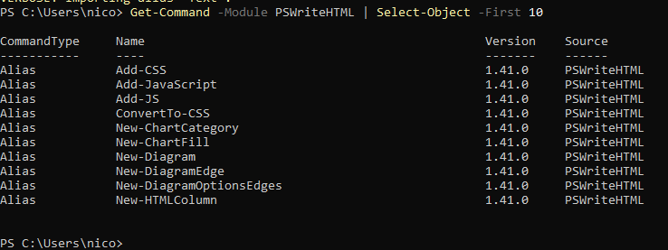

===================================================
Chapter 2: Installation, Dependencies, and Setup
===================================================

.. contents:: Table of Contents
   :local:
   :depth: 2

Installation Overview
=====================

Before using **PSWriteHTML** to construct interactive reports, dashboards, or emails, you must properly set up the PowerShell environment and ensure
all core and optional module dependencies are available. 

PSWriteHTML is distributed via the `PowerShell Gallery <https://www.powershellgallery.com/packages/PSWriteHTML>`_ and supports cross-platform
execution on Windows, macOS, and Linux.

Prerequisites & Requirements
============================

PSWriteHTML works across major PowerShell editions and operating systems:

* **PowerShell 5.1** (Windows PowerShell included with Windows 10/11 & Windows Server 2016+)
* **PowerShell 7.x+** (PowerShell Core — Windows, macOS, Linux)
* **Execution Policy:** Must permit running locally installed scripts (e.g., ``RemoteSigned`` or ``Unrestricted``).

.. note::
   PowerShell 7.x is recommended for optimal performance, especially when processing large datasets or generating complex multi-tab reports with heavy DataTables integration.

This manual was written for version 1.41.0 and later of PSWriteHTML. For older versions, refer to the archived documentation on the GitHub repository.

Module Dependencies
===================

PSWriteHTML is designed as an ecosystem parent/child module. Depending on the visual components you use (charts, diagrams, color palettes), PSWriteHTML automatically utilizes or suggests complementary modules developed by Evotec:

Primary Dependencies
--------------------

+-----------------------+--------------------------------------------------------------------+
| Module Name           | Purpose / Functionality                                            |
+=======================+====================================================================+
| **PSSharedGoods**     | Core helper functions, file handling, and string manipulation.     |
+-----------------------+--------------------------------------------------------------------+
| **PSWriteColor**      | Enhanced console output formatting during report generation.       |
+-----------------------+--------------------------------------------------------------------+
| **Connectimo**        | Optional network visualizer integration for topology diagrams.     |
+-----------------------+--------------------------------------------------------------------+

.. warning::
   When installing PSWriteHTML via ``Install-Module``, PowerShell automatically resolves and installs required dependencies like ``PSSharedGoods``. If installing manually in an isolated/air-gapped environment, you must copy these dependency modules manually.

Installation Methods
====================

Method 1: Installation from PowerShell Gallery (Recommended)
------------------------------------------------------------

The quickest way to install PSWriteHTML for the current user or system-wide is using ``Install-Module``.

**For the Current User (No Admin Rights Required):**

.. code-block:: powershell

   Install-Module -Name PSWriteHTML -Scope CurrentUser -Repository PSGallery -Force

**System-Wide (Requires Administrator Privilege):**

.. code-block:: powershell

   Install-Module -Name PSWriteHTML -Scope AllUsers -Repository PSGallery -Force

Method 2: Offline / Air-Gapped Installation
-------------------------------------------

If your target machine lacks direct internet access (e.g., secure production servers), download the module on an internet-connected machine and transfer it.

1. **Save the module and dependencies to a local folder:**

   .. code-block:: powershell

      Save-Module -Name PSWriteHTML -Path "C:\OfflineModules" -Repository PSGallery

2. **Copy the folder** to the target machine's PowerShell module directory:
   
   * **Windows PowerShell 5.1:** ``C:\Program Files\WindowsPowerShell\Modules\``
   * **PowerShell 7 (All Users):** ``C:\Program Files\PowerShell\7\Modules\``
   * **PowerShell 7 (Current User):** ``$HOME\Documents\PowerShell\Modules\``

3. **Verify the path is listed in environment variables:**

   .. code-block:: powershell

      $env:PSModulePath -split ';'

Method 3: Automated Scripting / CI/CD Pipeline
------------------------------------------------

For automated deployment pipelines (GitHub Actions, Azure DevOps, Jenkins), ensure the package provider is updated before installing:

.. code-block:: powershell

   # Trust PowerShell Gallery and install silently
   Set-PSRepository -Name 'PSGallery' -InstallationPolicy Trusted
   Install-Module -Name PSWriteHTML -Scope CurrentUser -Force -AllowClobber

Verifying the Installation
==========================

After completing installation, verify that the module is imported correctly and inspect available cmdlets.

1. **Check Installed Version:**

   .. code-block:: powershell

      Get-InstalledModule -Name PSWriteHTML

2. **Import and Inspect Available Cmdlets:**

   .. code-block:: powershell

      Import-Module PSWriteHTML -Verbose
      Get-Command -Module PSWriteHTML | Select-Object -First 10

   *Expected output includes core functions like ``New-HTML``, ``New-HTMLTab``, ``New-HTMLTable``, and ``New-HTMLChart``.*

   PowerShell modules available after installing PSWriteHTML and its dependencies.

   *Successful setup allows instant execution of DSL-based layout commands.*

If you should face any errors with the PowerShell execution policy that prevents script execution, you can normally resolve it by
running the following command:

   .. code-block:: powershell

      Set-ExecutionPolicy -ExecutionPolicy RemoteSigned -Scope CurrentUser

Updating & Uninstalling
=======================

Updating to the Latest Version
------------------------------

To update PSWriteHTML and pull in the latest web libraries (ApexCharts, DataTables, FontAwesome updates):

.. code-block:: powershell

   Update-Module -Name PSWriteHTML -Force

Uninstalling the Module
-----------------------

To remove PSWriteHTML and clean up the environment:

.. code-block:: powershell

   Remove-Module -Name PSWriteHTML -ErrorAction SilentlyContinue
   Uninstall-Module -Name PSWriteHTML -AllVersions -Force

Importing the module
====================

As usual with PowerShell modules, before using the module you should import it with the following command:

.. code-block:: powershell

   Import-Module PSWriteHTML  

But this is not mandatory because PowerShell 3.0+ supports module auto-loading: when you execute a command belonging to an
installed module, PowerShell automatically imports the module, provided the module is in $env:PSModulePath and you're using a modern version of
PowerShell. From now on, all examples in this manual will not explicitly import the module at the beginning of the script.

On the other hand, if you want to use the module in a script, it is recommended to import it explicitly at the beginning of the script, so that:

* makes the script's dependency obvious
* causes a failure immediately if PSWriteHTML cannot be loaded
* makes troubleshooting easier

Troubleshooting Common Setup Issues
===================================

**Issue: Script Execution Disabled**
   * *Error:* ``...cannot be loaded because running scripts is disabled on this system.``
   * *Solution:* Run ``Set-ExecutionPolicy -ExecutionPolicy RemoteSigned -Scope CurrentUser``.

**Issue: NuGet Provider Prompt**
   * *Error:* ``NuGet provider is required to continue...``
   * *Solution:* Force NuGet provider installation with ``Install-PackageProvider -Name NuGet -MinimumVersion 2.8.5.201 -Force``.

**Issue: Dependency Conflict**
   * *Error:* Multiple versions of ``PSSharedGoods`` loaded.
   * *Solution:* Remove older module versions using ``Uninstall-Module PSSharedGoods -AllVersions`` and re-import PSWriteHTML.

----

**Next Chapter:** :doc:`Chapter 3: Basic HTML Structure and Document Flow <chapter-03>`
