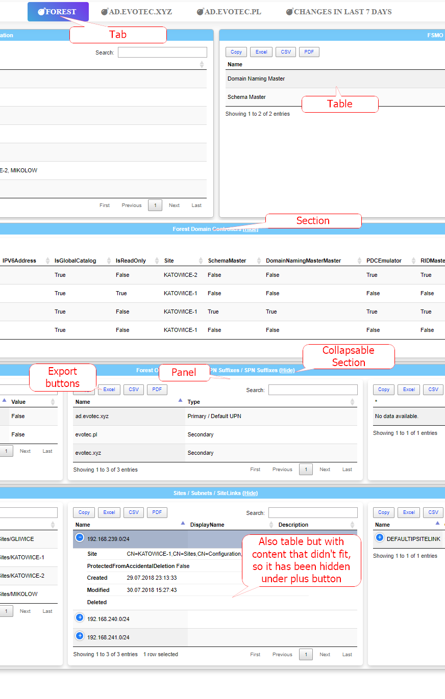
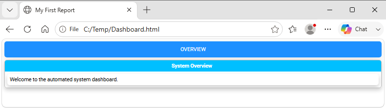
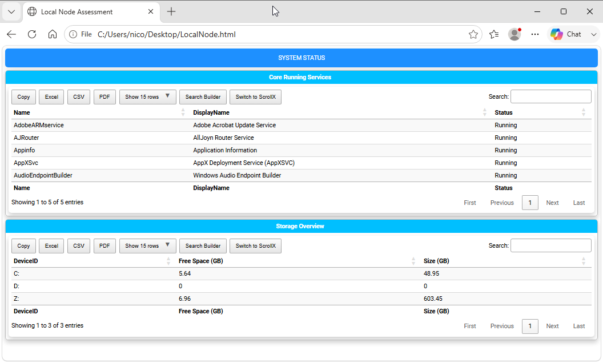

======================================================
Chapter 3: Basic HTML Structure and Document Flow
======================================================

.. contents:: Table of Contents
   :local:
   :depth: 2

Structure Overview
==================

Building reports with **PSWriteHTML** relies on a clear, hierarchical layout engine based on PowerShell script blocks (``{ ... }``). Understanding how components wrap inside one another allows you to build everything from a quick single-page summary table to a complex, multi-tab executive dashboard.

This chapter details the fundamental document containers, structural scope rules, page configuration options, and the general flow of a PSWriteHTML script.

The Component Hierarchy Model
=============================

PSWriteHTML enforces a top-down structural sequence. Each element acts as a visual container for the elements beneath it.

.. code-block:: text

   Document Container    ──>  New-HTML
      └── Tab Container  ──>      ├── New-HTMLTab (Page / Tab Level)
         └── Section     ──>      │     └── New-HTMLSection (Row / Banner Level)
            └── Panel    ──>      │           └── New-HTMLPanel (Card / Content Container)
               └── Content ──>    │                 ├── New-HTMLTable
                                  │                 ├── New-HTMLChart
                                  │                 └── New-HTMLText

Container Levels Explained
--------------------------

1. **Root Container (New-HTML):** The mandatory parent wrapper. Configures global settings, file output path, HTML header metadata, themes, and CSS imports.
2. **Tabs (New-HTMLTab):** Primary navigation containers. Each tab generates a top-level tab button to switch between independent views within the same HTML file.
3. **Sections (New-HTMLSection):** Horizontal grouping rows within a tab. Sections organize content vertically and can feature section header titles.
4. **Panels (New-HTMLPanel):** Content cards inside a section. Panels hold visual widgets such as tables, charts, diagrams, or free-form text blocks, arranging them into structured columns or grid blocks.

   A tabbed dashboard built from nested PSWriteHTML layout commands.

   *A tabbed dashboard created using simple nested script blocks in PowerShell.*

Core Syntax: Script Block Nesting
=================================

PSWriteHTML utilizes a nested **PowerShell DSL (Domain-Specific Language)** structure. Instead of building HTML tags
manually, you nest PowerShell script blocks (``{ ... }``) within parent components.

Basic Syntax Pattern
--------------------

.. code-block:: powershell

   New-HTML -FilePath "C:\Reports\Dashboard.html" -Title "My First Report" {
       New-HTMLTab -Name "Overview" {
           New-HTMLSection -HeaderText "System Overview" {
               New-HTMLPanel {
                   New-HTMLText -Text "Welcome to the automated system dashboard."
               }
           }
       }
   }

.. note::
   The curly braces ``{ ... }`` define the scope of each container. Indenting nested blocks makes complex reports significantly easier to maintain and troubleshoot.

Configuring Document-Level Properties (``New-HTML``)
====================================================

The `New-HTML <https://github.com/EvotecIT/PSWriteHTML/blob/master/Docs/New-HTML.md>`_ cmdlet controls global document behaviors, including output file path, title, theme,
and asset resolution. It is the only mandatory cmdlet in a PSWriteHTML script, except Out-HtmlView.

.. hint::
   You can see the official reference pages for all the PSWriteHTML commands with a complete list of parameters and their descriptions on the
   `online GitHub repository <https://github.com/EvotecIT/PSWriteHTML/blob/master/Docs>`_.
   
   

Key parameters include:

Output Controls
---------------

* **-FilePath:** Specifies the absolute or relative target path for the saved ``.html`` file.
  If ``-FilePath`` is omitted, the module generates a temporary file in the system's temp directory.
* **-Show:** Switch parameter that automatically launches the default web browser upon file creation.
  You can also use ``-ShowHTML`` which is an alias for the same functionality.
* **-Title:** Sets the HTML ``<title>`` tag displayed in browser tabs.

HTML generation Options
-----------------------

* **-Online:** Loads web assets (Bootstrap, DataTables, FontAwesome) from Internet via public CDN URLs. [default]
* **-Offline:** Embeds all static script assets  in the HTML file itself (ideal for air-gapped environment reporting).

Simple Example of PSWriteHTML usage
===================================

Here is a first example of its usage:

.. literalinclude:: sources/chapter-03-first-report.ps1
   :language: powershell

It produces a simple data table, as shown below:

   A first PSWriteHTML report rendered from a PowerShell script.

Building Your First Complete Report
===================================

The following complete script demonstrates how to query Windows services, disk drives, and system uptime, then render them into a formatted multi-panel single-tab report.

.. literalinclude:: sources/chapter-03-local-node-assessment.ps1
   :language: powershell

   A local-node assessment report with service, disk, and uptime panels.

   *Resulting table presentation created by nesting `New-HTMLTable` within `New-HTMLPanel` containers.*

Deep Dive: Online vs. Offline Resource Embedding
================================================

One of the most critical architecture features of PSWriteHTML is how it handles web assets (JavaScript libraries, CSS stylesheets, and font glyphs).
Understanding this mechanism ensures your reports function reliably across both internet-connected and air-gapped enterprise environments.

Online Mode (Default)
---------------------

When generating a document without extra asset flags (or explicitly using ``-Online``):

* **Mechanism:** The generated HTML file includes lightweight link tags pointing to high-speed public Content Delivery Networks (CDNs) for DataTables,
  FontAwesome, ApexCharts, and jQuery.
* **File Size:** Output `.html` files remain tiny—often under **50 KB**—because no asset binaries are stored inside the document.
* **Best Used For:** Internal dashboards hosted on corporate web servers where endpoint devices have open internet access.

Offline Mode (100% Self-Contained Output)
-----------------------------------------

When building reports for secure, isolated, or air-gapped networks, add the ``-Offline`` switch parameter to ``New-HTML``:

.. code-block:: powershell

   New-HTML -Title "Air-Gapped Infrastructure Report" -FilePath "C:\Reports\Status.html" -Offline {
       ...
   }

When ``-Offline`` is specified, PSWriteHTML changes how it builds the document:

1. **Local File Extraction:** Instead of referencing external CDN URLs, the engine reads the bundled JavaScript libraries, CSS stylesheets, and web font
   files directly from the installed PSWriteHTML module directory on your build server.
2. **Base64 Encoding & Inlining:** The engine reads the raw CSS, JS, and font binaries, converts them into Base64 data strings, and embeds
   them **directly inline** within ``<style>`` and ``<script>`` tags inside the single HTML output document.
3. **Zero External Dependencies:** No secondary asset folders, subdirectories, or auxiliary `.css`/`.js` files are created alongside your output file.

Key Architectural Takeaway
--------------------------

Because ``-Offline`` mode creates a **single, 100% self-contained HTML file**, you can copy, relocate, or host that single `.html` file anywhere:

* You can move it to an isolated IIS server without needing to copy accompanying asset subfolders.
* You can attach it to an email, open it off a USB drive, or view it on an isolated machine with no network connection.
* All table sorting, search filtering, dynamic charts, and vector icons will function completely offline.

.. note::
   Because all JavaScript engines and vector fonts are embedded into the file, an ``-Offline`` report file size typically starts around **2 MB to 5 MB**.
   For high-density reporting, this trade-off guarantees total portability across secure subnets.

Common Document Flow Mistakes
=============================

1. **Orphaned Content Cmdlets:**
   Placing a ``New-HTMLTable`` or ``New-HTMLText`` directly inside ``New-HTML`` without a surrounding ``New-HTMLTab`` or ``New-HTMLSection`` can cause formatting misalignment or missing element styles.

2. **Unclosed Braces:**
   Omitting a closing script block brace ``}`` breaks PowerShell syntax parsing. Always verify brace matching when adding deep nesting levels.

3. **Mixing Data Collection inside DSL Blocks:**
   For performance and readability, gather all data into variables **before** calling ``New-HTML``. Executing heavy PowerShell cmdlets (like ``Get-ADUser``) directly inside nested script blocks slows down document construction and complicates debugging.

----

**Next Chapter:** :doc:`Chapter 4: Working with DataTables and Data Grids <chapter-04>`
