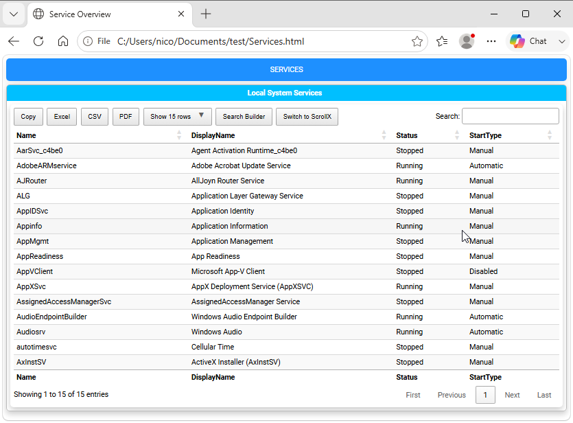
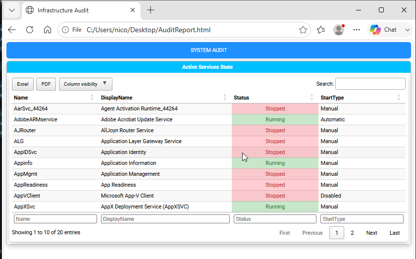

=========================================================
Chapter 4: Working with DataTables and Data Grids
=========================================================

.. contents:: Table of Contents
   :local:
   :depth: 2

DataTables Overview
===================

The core strength of **PSWriteHTML** lies in its integration with `DataTables <https://datatables.net/>`_. Instead of rendering static, unstyled HTML tables, the ``New-HTMLTable`` cmdlet converts standard PowerShell objects into fully interactive data grids complete with real-time searching, sorting, pagination, column visibility toggles, and direct data export options (PDF, Excel, CSV, Copy).

This chapter explains how to configure tables, apply conditional cell formatting, customize column properties, and optimize data grid performance.

Basic Table Generation (``New-HTMLTable``)
==========================================

To create a table, use the
`New-HTMLTable <https://github.com/EvotecIT/PSWriteHTML/blob/master/Docs/New-HTMLTable.md>`_  cmdlet, passing a collection of
PowerShell objects to the ``-DataTable`` parameter within a script block.

Here is a simple example of generating a table from the output of ``Get-Service``:

.. literalinclude:: sources/chapter-04-first-table.ps1
   :language: powershell

It produces a simple interactive table, as shown below:

   A first interactive DataTable with sorting, searching, and paging controls.

Interactivity Controls & Buttons
================================

You can fine-tune table controls using parameters on `New-HTMLTable <https://github.com/EvotecIT/PSWriteHTML/blob/master/Docs/New-HTMLTable.md>`_ :

Filtering and Pagination
------------------------

* **-Filtering** Adds column-based search input fields at the header or footer of the table [default: Not enabled].
* **-Paging $true:** Enables pagination controls.
* **-PageLength 25:** Sets the default number of rows displayed per page (e.g., 10, 25, 50, 100).
* **-SearchState $true:** Preserves search keywords and pagination states in browser session storage across page reloads.

.. warning::
   The ``-Filtering`` parameter is a switch, so (if ever needed) it must be specified without a value. Using ``-Filtering $true``
   will not enable filtering and may cause unexpected behavior.

Export Buttons & Feature Toggles
--------------------------------

PSWriteHTML allows users to download or copy table content directly from the generated HTML interface using
the ``-Buttons`` parameter:

.. code-block:: powershell

   New-HTMLTable -DataTable $Services -Buttons 'copyHtml5', 'excelHtml5', 'csvHtml5', 'pdfHtml5', 'print'

Common Button Types:

* **copyHtml5:** Copies current table contents to the clipboard.
* **excelHtml5:** Downloads table data as a native ``.xlsx`` spreadsheet.
* **csvHtml5:** Exports raw data as a comma-separated values file.
* **pdfHtml5:** Generates a downloadable PDF document from the current table view.
* **print:** Opens a printer-friendly view of the table in a new browser tab.
* **pageLength:** Adds a dropdown menu allowing users to select how many rows to display per page.
* **searchPanes:** Adds a sidebar panel for multi-column filtering with checkboxes.
* **searchBuilder:** Adds a panel for building complex search queries across multiple columns.
* **columnVisibility:** Adds a dropdown menu allowing users to dynamically hide or show specific table columns.
* **toggleView:** Switches between standard table view and card-based layout for mobile-friendly displays.

By default, PSWriteHTML includes many buttons in the generated table interface (see screenshot above).
You can customize which buttons appear, and even their order, by specifying a subset in the ``-Buttons`` parameter.

Sorting
=======

You can control the initial sort order of a table by specifying the ``-DefaultSortColumn`` and ``-DefaultSortOrder`` parameters
on ``New-HTMLTable``. For example:

.. code-block:: powershell

   New-HTMLTable -DataTable $Services -DefaultSortColumn 'Name' -DefaultSortOrder 'Ascending'

Column Formatting & Customization (``New-TableContent`` and ``New-TableHeader``)
================================================================================

To customize individual columns, use nested
`New-TableContent <https://github.com/EvotecIT/PSWriteHTML/blob/master/Docs/New-TableContent.md>`_ and
`New-TableHeader <https://github.com/EvotecIT/PSWriteHTML/blob/master/Docs/New-TableHeader.md>`_ script blocks.
Use ``New-TableContent`` for cell formatting and ``New-TableHeader`` for displayed header names and header styling.

.. code-block:: powershell

   New-HTMLTable -DataTable $Services {
         New-TableContent -ColumnName 'Status' -Alignment center
         New-TableHeader -Names 'StartType' -Title 'Startup Type'
   }

New-TableContent Parameters
---------------------------

* **-ColumnName:** Exact property name from the incoming PowerShell object.
* **-Alignment:** Text alignment: ``left``, ``center``, or ``right``.

New-TableHeader Parameters
--------------------------

* **-Names:** Column name or names whose table headers should be customized.
* **-Title:** Custom display title for the selected table header.
* **-Alignment:** Text alignment: ``left``, ``center``, or ``right``.

Conditional Formatting & Cell Highlighting (``New-TableCondition``)
===================================================================

Visual indicators are crucial for system health reports. PSWriteHTML allows conditional styling based on exact string
values, numbers, or comparison operators using
`New-TableCondition <https://github.com/EvotecIT/PSWriteHTML/blob/master/Docs/New-TableCondition.md>`_.

Coloring Cells Based on Status
------------------------------

The following example highlights services based on whether they are running or stopped:

.. code-block:: powershell

   New-HTMLTable -DataTable $Services {
       
       # Highlight "Running" status in light green
         New-TableCondition -Name 'Status' -ComparisonType string -Operator eq -Value 'Running' -BackgroundColor '#d4edda' -Color '#155724'
       
       # Highlight "Stopped" status in light red with bold text
         New-TableCondition -Name 'Status' -ComparisonType string -Operator eq -Value 'Stopped' -BackgroundColor '#f8d7da' -Color '#721c24' -FontWeight bold
   }

Comparison Operators
--------------------

In addition to exact string matching, comparison logic supports numeric thresholds:

* **-Operator 'eq'** (Equal)
* **-Operator 'ne'** (Not Equal)
* **-Operator 'gt'** / **-Operator 'ge'** (Greater Than / Greater Than or Equal)
* **-Operator 'lt'** / **-Operator 'le'** (Less Than / Less Than or Equal)
* **-Operator 'contains'** (Substring match)

Numeric Range Example
---------------------

.. code-block:: powershell

   $Disks = Get-CimInstance Win32_LogicalDisk | Select-Object DeviceID, @{N='FreeSpaceGB'; E={[math]::Round($_.FreeSpace/1GB, 2)}}

   New-HTMLTable -DataTable $Disks {
       # Highlight drives with less than 15 GB free space in warning red
          New-TableCondition -Name 'FreeSpaceGB' -ComparisonType number -Operator lt -Value 15 -BackgroundColor '#ff4d4d' -Color '#ffffff'
   }

Complete Example: Interactive Disk & Service Dashboard
======================================================

Here is a full, ready-to-run script combining pagination, export buttons, column formatting, and conditional color highlighting:

.. literalinclude:: sources/chapter-04-complete-table.ps1
   :language: powershell

It produces a complete colored interactive table, as shown below:

   A complete DataTable combining export buttons, sorting, and conditional formatting.

   *Combining table conditions and controls results in clean, executive-ready documentation.*

Performance Tips for Large Datasets
===================================

When outputting tables containing tens of thousands of rows (such as Active Directory event logs or large file system scans), consider these optimization guidelines:

1. **Limit Selected Properties:** Pre-filter objects with ``Select-Object`` in PowerShell before passing them to ``-DataTable``.
2. **Disable Unnecessary Search Controls:** Do not use the ``-Filtering`` switch parameter if it's not needed, as this reduces
   browser processing overhead on massive DOM trees.
3. **Use Default Page Lengths:** Keep ``-PageLength`` at 25 or 50 so the browser only renders visible rows into memory.

----

**Next Chapter:** :doc:`Chapter 5: Visualizing Data with Charts and Graphs <chapter-05>`
