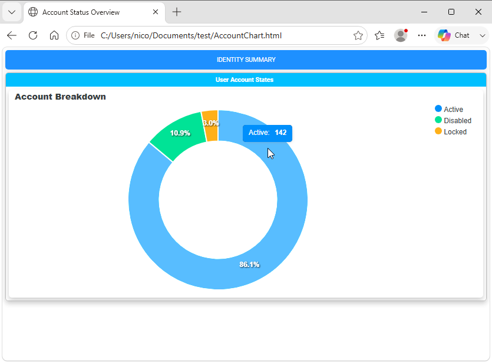
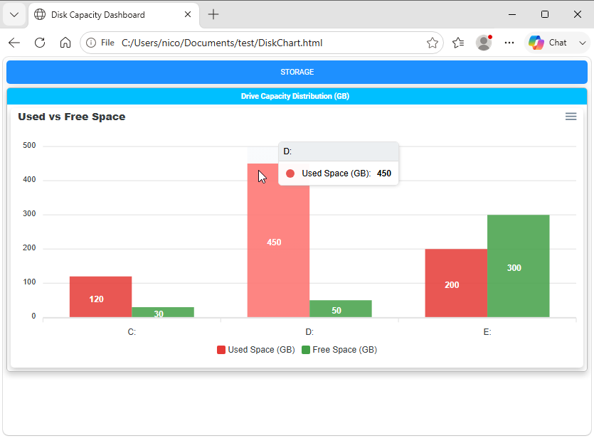
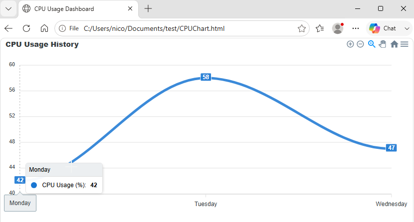
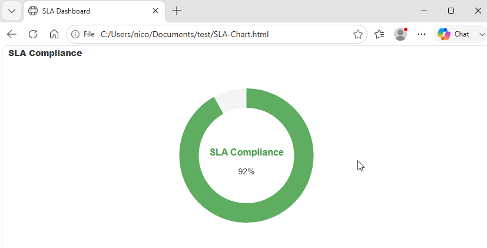
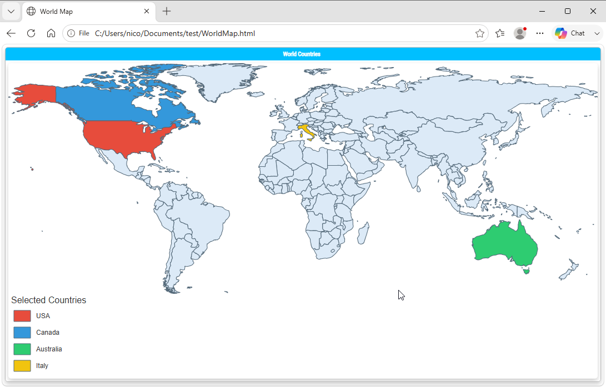
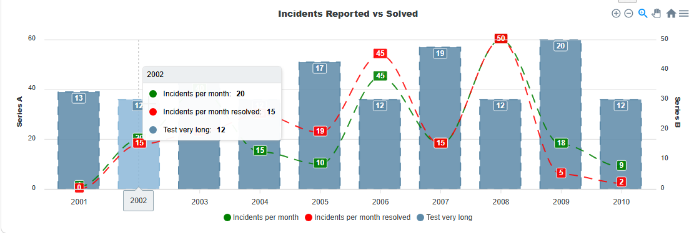
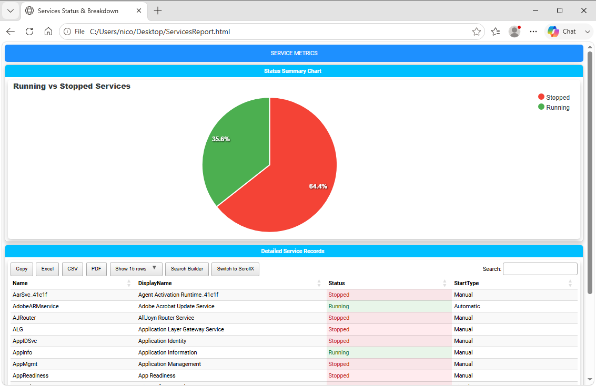

=========================================================
Chapter 5: Visualizing Data with Charts and Graphs
=========================================================

.. contents:: Table of Contents
   :local:
   :depth: 2

Charts and Graphs Overview
==========================

While data grids excel at granular details, visual summaries are often necessary for executive dashboards and high-level health assessments.
**PSWriteHTML** includes native support for interactive charts powered by `ApexCharts <https://apexcharts.com/>`_, enabling
you to build dynamic bar, line, pie, donut, area, radar, and gauge charts directly from PowerShell objects.

With the `New-HTMLChart <https://github.com/EvotecIT/PSWriteHTML/blob/master/Docs/New-HTMLChart.md>`_   cmdlet, you can turn raw numerical metrics into
responsive visual representations featuring tooltips, legends, animations, and image export options.

Chart Types Overview
====================

PSWriteHTML supports multiple chart archetypes depending on the data structure:

+-----------------+-----------------------------------+------------------------------------------------------------+
| Chart Type      | Target Cmdlet / Parameter         | Best Used For                                              |
+=================+===================================+============================================================+
| **Bar / Column**| ``New-ChartBar``                  | Comparing discrete values across categories (e.g., Disk    |
|                 |                                   | space by volume, services by state).                       |
+-----------------+-----------------------------------+------------------------------------------------------------+
| **Pie / Donut** | ``New-ChartDonut``                | Displaying proportional distribution or percentages        |
|                 |                                   | (e.g., OS breakdown, memory usage).                        |
+-----------------+-----------------------------------+------------------------------------------------------------+
| **Line / Area** | ``New-ChartLine``                 | Tracking trends over continuous time series or sequential  |
|                 |                                   | data points (e.g., CPU load history).                      |
+-----------------+-----------------------------------+------------------------------------------------------------+
| **Gauge**       | ``New-ChartRadial``               | Representing progress toward a single threshold or target  |
|                 |                                   | percentage (e.g., SLA compliance score).                   |
+-----------------+-----------------------------------+------------------------------------------------------------+

Creating Your First Chart (``New-HTMLChart``)
=============================================

To render a chart, place one or more chart builder commands such as ``New-ChartBar``, ``New-ChartLine``, or
``New-ChartDonut`` inside the `New-HTMLChart <https://github.com/EvotecIT/PSWriteHTML/blob/master/Docs/New-HTMLChart.md>`_  script
block. The nested command determines the chart type.

Basic Donut Chart Example
-------------------------

The following example gathers fake account status distributions and displays them in
an interactive donut chart:

.. literalinclude:: sources/chapter-05-donut.ps1
   :language: powershell

This is the result:

   A donut chart showing the distribution of account statuses.

Bar and Column Charts
=====================

Bar and column charts are ideal for comparing system statistics side by side, such as disk utilization across
multiple servers.

Multi-Series Bar Chart Example
------------------------------

.. literalinclude:: sources/chapter-05-bar.ps1
   :language: powershell

This is the result:

   A multi-series bar chart comparing values across categories.

Line Charts
===========

Line charts are useful for showing how a value changes across an ordered sequence, such as CPU usage measured over several days.
Use `New-ChartAxisX <https://github.com/EvotecIT/PSWriteHTML/blob/master/Docs/New-ChartAxisX.md>`_  to define the categories
and `New-ChartLine <https://github.com/EvotecIT/PSWriteHTML/blob/master/Docs/New-ChartLine.md>`_  to provide one or more named series with matching values:

.. literalinclude:: sources/chapter-05-line.ps1
   :language: powershell

This is the result:

   A line chart displaying changes across an ordered sequence.

Note that line chart have a built-in tooltip that displays the series name and value when hovering over a data point. You can also customize the line color, width, and style using parameters in `New-ChartLine`.
Also, for line charts, a new menu appears in the top-right corner of the chart, allowing users to toggle series visibility, pan/zoom in/out, and export the chart as an image or PDF.

Radial Gauge Charts
===================

Radial charts display a progress or percentage value against an implicit target of 100, making them suitable for metrics such as SLA compliance.
Pass the metric label to ``-Name`` and its numeric value to ``-Value``:

.. literalinclude:: sources/chapter-05-radial.ps1
   :language: powershell

This example displays an SLA compliance score of 92 percent in a radial gauge.

   A radial gauge chart showing an SLA compliance score.

Interactive Geographic Maps with ``New-HTMLMap``
================================================

For geographic visualizations, `New-HTMLMap <https://github.com/EvotecIT/PSWriteHTML/blob/master/Docs/New-HTMLMap.md>`_ renders an
interactive map using one of PSWriteHTML's built-in regions. Use ``-Map`` to select ``Poland``, ``Usa_States``,
``World_Countries``, or ``European_Union``. You can customize the map with parameters such as ``-AnchorName``, ``-AreaTitle``,
``-PlotTitle``, ``-FillColor``, ``-StrokeColor``, ``-StrokeWidth``, ``-ShowAreaLegend``, and ``-ShowPlotLegend``. For data-driven
area colors or plotted values, use ``-MapSettings`` to provide the map areas, plots, and legend configuration.

The following example creates a simple interactive world map:

.. literalinclude:: sources/chapter-05-basic-map.ps1
   :language: powershell

That renders nicely:

   An interactive world map rendered with PSWriteHTML.

Chart Styling and Customization Options
=======================================

`New-HTMLChart <https://github.com/EvotecIT/PSWriteHTML/blob/master/Docs/New-HTMLChart.md>`_  and its nested chart builder commands expose extensive options to match corporate branding or dashboard requirements:

Color Schemes & Themes
----------------------

* **-Color:** Pass a hex color to ``New-ChartBar``, ``New-ChartPie``, or another chart builder to customize a series or slice. If not
  specified, a default color will be used.
* **New-ChartTheme -Palette:** Select a pre-built color palette (e.g., ``palette1`` through ``palette10``).

Sizing and Layout
-----------------

* **-Height:** Set height explicitly in pixels (e.g., ``-Height 400``).
* **-Width:** Set width explicitly in pixels (e.g., ``-Width 600``). If omitted, the chart will expand to fill its container.
* **New-ChartLegend -LegendPosition:** Control where dataset legends appear (``top``, ``bottom``, ``left``, ``right``).
* **New-ChartSpark:** Creates a minimalist inline chart without axes or legends, ideal for executive metric summary cards.

   A combined chart view with multiple visualizations in one report.

   *You can also combine multiple charts into a single one.*

Combining Charts and Tables
===========================

For comprehensive reporting, you can place charts and DataTables side-by-side or stacked inside the same section to provide both high-level visual summaries and actionable underlying records.

Full Operational Example: Service Distribution Report
-----------------------------------------------------

.. literalinclude:: sources/chapter-05-with-table.ps1
   :language: powershell

The result is a dashboard that combines a pie chart for service status with a detailed service status table below it:

   A service-status report combining a pie chart with a detailed table.

.. note::
   For an interactive example that correlates chart selections with table rows using ``-DataTableID``, ``-ID``, and ``-ColumnID``,
   see :ref:`Correlating Tables and Charts with Events <correlating-tables-and-charts>` on Chapter 11.

Chart Best Practices
====================

1. **Avoid Overcrowding Categories:** Pie and donut charts become unreadable with more than 7–8 slices.
   Group small items into an "Other" category prior to rendering.
2. **Explicit Colors for Statuses:** Consistently assign red/green/yellow hex values for status indicators
   (e.g., pass/fail or warning/critical states) rather than relying on random theme colors.
3. **Set Fixed Heights:** Specifying ``-Height`` ensures layout consistency across different desktop monitor resolutions.

----

**Next Chapter:** :doc:`Chapter 6: Organizing Content with Tabs, Sections, and Panels <chapter-06>`
