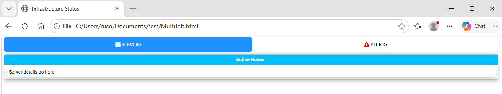
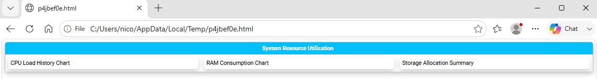
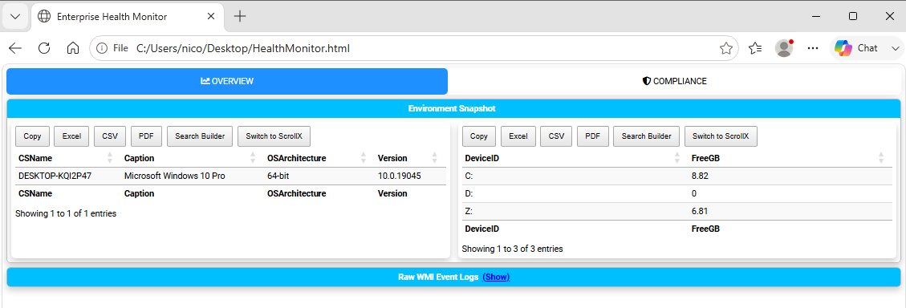

========================================================================
Chapter 6: Organizing Content with Tabs, Sections, and Panels
========================================================================

.. contents:: Table of Contents
   :local:
   :depth: 2

Report Structure Overview
=========================

As reports grow in scope and complexity, structure becomes as vital as the data itself. **PSWriteHTML** provides a
modular, responsive layout engine based on a hierarchical grid model. 

By strategically combining **Tabs**, **Sections**, **Panels**, and **Columns**, you can transform long, overwhelming
operational logs into structured, executive-ready dashboards.

We've already introduced the basic building blocks in Chapter 3, but this chapter delves deeper into advanced layout techniques,
best practices for multi-tab navigation, and strategies for creating visually appealing, data-rich reports.

Layout Architecture Deep-Dive
=============================

The layout engine uses a nested container model that flows from top-level navigation down to individual content cards:

.. code-block:: text

   New-HTML
   └── New-HTMLTab (Top Navigation)
       └── New-HTMLSection (Horizontal Row)
           └── New-HTMLPanel (Card Container)
               └── Content Widgets (Tables, Charts, Text, Diagrams)

Component Responsibilities
--------------------------

* **New-HTMLTab:** Acts as the primary top-level menu item. Each tab hides or shows full logical sub-pages without reloading
  the browser.
* **New-HTMLSection:** Functions as a full-width horizontal row or banner within a tab. Sections isolate distinct reporting
  topics (e.g., "CPU Metrics" vs "Memory Usage").
* **New-HTMLPanel:** Acts as a floating card or column block within a section. Panels wrap specific tables, charts, or text
  blocks with clean borders and background padding.

Mastering Tabs (``New-HTMLTab``)
================================

`New-HTMLTab <https://github.com/EvotecIT/PSWriteHTML/blob/master/Docs/New-HtmlTab.md>`_  allow you to pack dozens of metrics
into a single standalone HTML document while keeping the viewport clutter-free.

Tab Customization Options
-------------------------

* **-Name:** Text displayed on the navigation button.
* **-IconSolid / ``-IconRegular`` / ``-IconBrands``:** Adds a `FontAwesome <https://fontawesome.com/>`_ icon to the tab title
  (e.g., ``-IconSolid 'server'``  or ``-IconBrands 'windows'``).
* **-IconColor:** Hex or color text for the FontAwesome icon (e.g., ``-IconColor 'Red'`` or ``-IconColor '#FF0000'``).

Tab Icon Example
----------------

.. literalinclude:: sources/chapter-06-tabs.ps1
   :language: powershell

This is the result:

   A report organized with tabbed navigation.

Section & Column Grid Layouts
=============================

By default, every `New-HTMLPanel  <https://github.com/EvotecIT/PSWriteHTML/blob/master/Docs/New-HTMLPanel.md>`_  added inside a
`New-HTMLSection <https://github.com/EvotecIT/PSWriteHTML/blob/master/Docs/New-HTMLSection.md>`_  expands to fill the available width. When multiple
panels are placed within the same section, PSWriteHTML automatically arranges them into multi-column side-by-side card grids.

Creating Multi-Column Layouts
-----------------------------

To create a 2-column or 3-column dashboard row, place multiple `New-HTMLPanel <https://github.com/EvotecIT/PSWriteHTML/blob/master/Docs/New-HTMLPanel.md>`_  
blocks inside a single `New-HTMLSection <https://github.com/EvotecIT/PSWriteHTML/blob/master/Docs/New-HTMLSection.md>`_ .

.. literalinclude:: sources/chapter-06-panels.ps1
   :language: powershell

This is the result:

   Three panels arranged in a responsive multi-column section.

   *Three panels placed inside a single section, automatically flowing into an aligned multi-column grid.*

Collapsible Sections
--------------------

For detailed logs or secondary diagnostic details that do not need to be visible immediately, make a section collapsible with the switch ``-CanCollapse`` and start it
collapsed with the related switch ``-Collapsed``:

.. code-block:: powershell

   New-HTMLSection -HeaderText "Advanced Active Directory Diagnostics" -CanCollapse -Collapsed {
       New-HTMLPanel {
           New-HTMLText -Text "Detailed diagnostic logs and raw output parameters..."
       }
   }

Panel Styling & Backgrounds
---------------------------

You can highlight critical information by applying custom background shades or text styles directly to panels:

* **-BackgroundColor:** Hex code or CSS color name for the panel background.
* **-HeaderText on New-HTMLSection:** Adds a header above the section, which can also be made collapsible.
  

Complete Operational Dashboard Example
======================================

The following script combines multi-tab navigation, FontAwesome icons, status badges, multi-column sections, and a collapsible diagnostic section:

.. literalinclude:: sources/chapter-06-full.ps1
   :language: powershell

This is the result:

   A complete operational dashboard with tabs, panels, icons, and collapsible content.

Layout Design Rules
===================

1. **Keep Related Metrics Grouped:** Use a single ``New-HTMLSection`` for metrics that need side-by-side visual comparison (e.g., Disk Space and Disk I/O).
2. **Limit Primary Tabs:** Limit top-level tabs to 5–7 items to prevent tab-bar wrapping on lower-resolution screens.

----

**Next Chapter:** :doc:`Chapter 7: Network Diagrams, Flowcharts, and Visualizations <chapter-07>`
