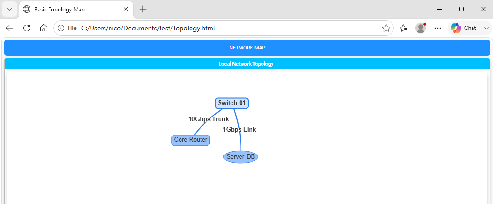
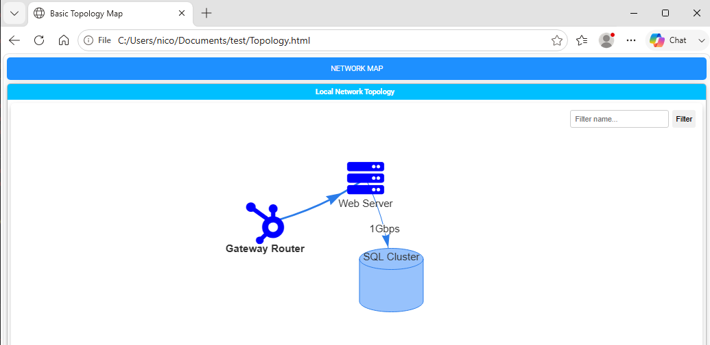
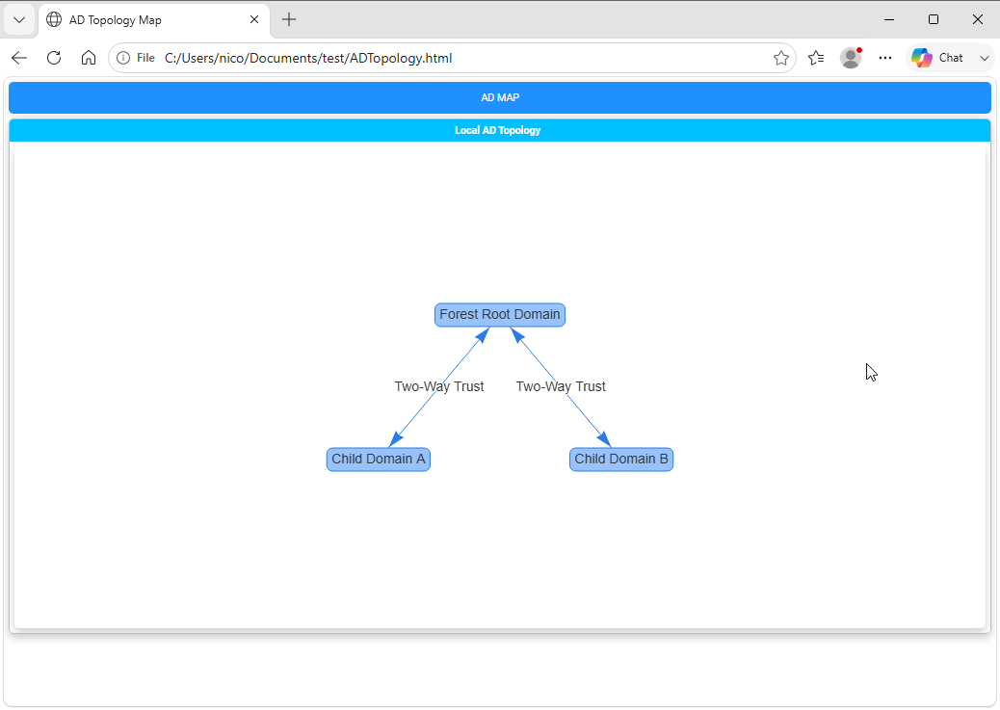
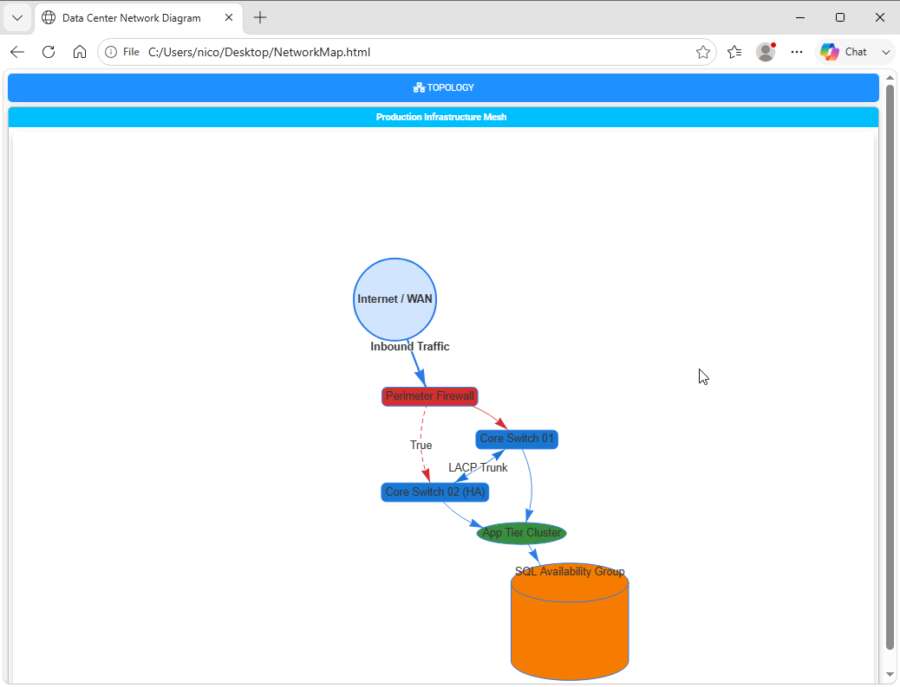

========================================================================
Chapter 7: Network Diagrams, Flowcharts, and Visualizations
========================================================================

.. contents:: Table of Contents
   :local:
   :depth: 2

Complex visualizations overview
===============================

Beyond tables and charts, complex IT environments frequently require structural visualization—such as Active Directory trust maps,
network topology diagrams, cloud architecture maps, and organizational hierarchies.

**PSWriteHTML** includes native support for interactive diagramming powered by `Vis Network <https://visjs.org/>`_ through the ``New-HTMLDiagram``
cmdlet. You can build nodes, connections, flowcharts, and relational graphs dynamically using pure PowerShell syntax without needing external
design tools like Visio or Lucidchart.

Core Diagram Concepts: Nodes and links
======================================

Diagrams in PSWriteHTML are constructed using two primary structural primitives inside
a `New-HTMLDiagram <https://github.com/EvotecIT/PSWriteHTML/blob/master/Docs/New-HTMLDiagram.md>`_ container:

1. **Nodes (New-DiagramNode):** Visual entities (e.g., servers, routers, switches, user accounts, cloud databases).
2. **Links (New-DiagramLink):** Directional or non-directional connection lines connecting two nodes (e.g., network cables, trust
   relationships, data flows).

.. note::
   Links in some outdated diagramming libraries are called "edges" or "connections." In PSWriteHTML, we use the term "links" to align with common
   networking terminology. ``New-DiagramLink`` has many aliases: ``DiagramLink``, ``DiagramEdge``, ``DiagramEdges`` and ``New-DiagramEdge``
   for backward compatibility.

Basic Diagram Syntax
--------------------

.. literalinclude:: sources/chapter-07-basic-diagram.ps1
   :language: powershell

This is the result, a simple network diagram with three nodes and two links, fully interactive with zooming, panning, and node dragging:

   A basic interactive diagram containing nodes and links.

Customizing Nodes (``New-DiagramNode``)
===========================================

Nodes are defined with `New-DiagramNode <https://github.com/EvotecIT/PSWriteHTML/blob/master/Docs/New-DiagramNode.md>`_ . They can be customized with
specific shapes, background colors, font styles, and FontAwesome icons to represent specific hardware or service roles.

Node Parameters & Options
-------------------------

* **-Id:** Unique identifier (integer or string) used to reference the node in link definitions. If
  not set, label will be used as Id.
* **-Label:** Display text shown on or below the node.
* **-Shape:** Geometry of the node (``circle``, ``dot``, ``diamond``, ``ellipse``, ``database``, ``box``,
  ``square``, ``triangle``, ``triangleDown``, ``text``, ``star``, ``hexagon``).    
* **-ColorBackground:** Hex color code for the internal node fill.
* **-ColorBorder:** Hex color code for the node outline.
* **-IconSolid / -IconBrands:** Embeds a FontAwesome vector icon inside the node. Cannot be used with ``-Shape`` values like ``box`` or ``ellipse``.

Customizing Connections (``New-DiagramLink``)
=================================================

`New-DiagramLink <https://github.com/EvotecIT/PSWriteHTML/blob/master/Docs/New-DiagramLink.md>`_  control how relationships between nodes are
visualized, supporting directional arrows, line styling, color coding, and labels.

Link Customization Parameters
-----------------------------

* **-From / -To:** IDs of the source and target nodes.
* **-ArrowsToEnabled:** Switch parameter to enable arrows at the end of the link.
* **-ArrowsToType:** Type of arrowhead to display at the end of the link. Valid values are 'arrow', 'bar', or 'circle'.
* **-Color:** Hex color code for the connection line.
* **-Dashed:** Boolean (``$true``/``$false``) to switch between solid and dashed lines (ideal for backup links or optional paths).
* **-Label:** Text annotation displayed along the link line.

Directional & Dashed Link Example
---------------------------------

.. code-block:: powershell

   New-DiagramLink -From "Firewall" -To "DMZ-Host" -ArrowsToEnabled -Color "#E53935" -Label "HTTPS (443)"
   New-DiagramLink -From "DMZ-Host" -To "Backup-Srv" -ArrowsToEnabled -Dashed $true -Color "#757575" -Label "Replication"

Node Icon & Color Example
-------------------------

A simple workflow diagram with three nodes and two directional links, fully interactive with customized icons, colors, and labels:

.. literalinclude:: sources/chapter-07-basic-network.ps1
   :language: powershell

This is the result:

   A directional network diagram with customized nodes and links.

Layout Hierarchies & Physics Engines
====================================

Vis Network includes physics engines that automatically arrange nodes dynamically or snap them into rigid hierarchical trees.

Hierarchical Layouts (Org Charts & Tree Diagrams)
-------------------------------------------------

For structured trees like Active Directory domain trust structures or organizational charts, enable hierarchical positioning
using `New-DiagramOptionsLayout <https://github.com/EvotecIT/PSWriteHTML/blob/master/Docs/New-DiagramOptionsLayout.md>`_ :

* **-HierarchicalEnabled:** Switch parameter to enable hierarchical layout.
* **-HierarchicalDirection:** The direction of the hierarchical layout. Valid values are: FromUpToDown, FromDownToUp, FromLeftToRight, FromRigthToLeft.

.. literalinclude:: sources/chapter-07-ad.ps1
   :language: powershell

This is the result:

   An Active Directory topology diagram using a hierarchical layout.

Complete Practical Example: Infrastructure Network Topology Map
================================================================

The following script gathers network interface data and constructs a multi-tier network map complete with interactive node dragging, zooming,
directional paths, and FontAwesome status indicators:

.. literalinclude:: sources/chapter-07-network.ps1
   :language: powershell

This is the result:

   An infrastructure network topology map with directional paths and status icons.

Diagramming Best Practices
==========================

1. **Explicit Heights:** Always set a explicit ``-Height`` parameter (e.g., ``"500px"`` or ``"700px"``) on ``New-HTMLDiagram`` to prevent canvas
   collapse inside panels.
2. **Unique Node IDs:** Ensure every node has a strictly unique ``-Id`` string or integer. Duplicate IDs cause link routing failures in Vis.js.
3. **Use Hierarchy for Trees:** When displaying parent-child structures (such as management org charts or DNS delegation trees), always
   enable ``New-DiagramOptionsLayout -HierarchicalEnabled $true`` to prevent nodes from drifting into floating physics clusters.

----

**Next Chapter:** :doc:`Chapter 8: Custom Styling, CSS, and Themes <chapter-08>`
