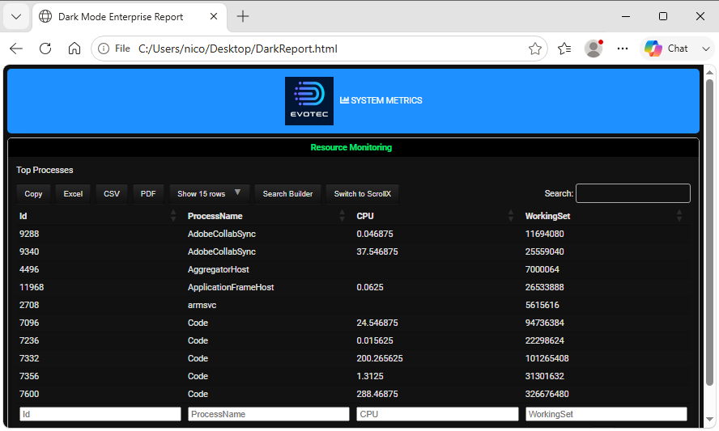

========================================================================
Chapter 8: Custom Styling, CSS, and Themes
========================================================================

.. contents:: Table of Contents
   :local:
   :depth: 2

Styling Overview
================

While **PSWriteHTML** ships with clean, modern styling out of the box, enterprise environments often require matching corporate design standards,
applying dark modes, or injecting custom typography and custom headers.

This chapter details how to inject custom CSS, apply custom typography, use FontAwesome icons, and override component styling directly using
PowerShell DSL parameters.

Document-Level Theme Configuration
==================================

The root `New-HTML <https://github.com/EvotecIT/PSWriteHTML/blob/master/Docs/New-HTML.md>`_ cmdlet provides the document container for
component-level styling and custom CSS. Header colors are configured on sections or through the corresponding style cmdlets.

Built-in Themes & Header Colors
-------------------------------

You can alter section colors directly with supported `New-HTMLSection <https://github.com/EvotecIT/PSWriteHTML/blob/master/Docs/New-HTMLSection.md>`_ 
parameters:

* **``-HeaderBackGroundColor``:** Sets the background color of a section header (Hex, RGB, or standard CSS color names).
* **``-HeaderTextColor``:** Controls the font color of a section header.
* **``-BackgroundColor``:** Sets the background color of a section (Hex, RGB, or standard CSS color names).

Basic Color Override Example
----------------------------

.. code-block:: powershell

   New-HTML -TitleText "Corporate Security Audit" -FilePath "Audit.html" -ShowHTML {
       
       New-HTMLTab -Name "Overview" {
           New-HTMLSection -HeaderText "Executive Summary" `
                          -HeaderBackGroundColor "#309135" `
                          -HeaderTextColor "#e01965" -BackgroundColor "lightyellow" {
               New-HTMLPanel {
                   New-HTMLText -Color Amazon -Text "All perimeter checks passed corporate baseline guidelines."
               }
           }
       }
   }

Custom CSS Injection (``Add-HTMLStyle``)
=========================================

For fine-grained visual control, PSWriteHTML uses the `Add-HTMLStyle <https://github.com/EvotecIT/PSWriteHTML/blob/master/Docs/Add-HTMLStyle.md>`_ 
function allows you to add CSS styles to HTML documents in various ways such as inline styles, external stylesheets,and content from files or strings.

Injecting Raw CSS
-----------------

Pass custom CSS rules to ``Add-HTMLStyle -Placement Header -Content`` to override fonts, table borders, panel padding, or background gradients
across the entire page:

.. code-block:: powershell

   # Define custom CSS rules for the entire document 
   $CustomStyles = @"
       body {
           font-family: 'Segoe UI', Tahoma, Geneva, Verdana, sans-serif;
           background-color: #f4f6f9;
       }
       .card {
           border-radius: 8px !important;
           box-shadow: 0 4px 6px rgba(0,0,0,0.1);
       }
       h1, h2, h3 {
           color: #1a202c;
       }
   "@

   New-HTML -TitleText "Custom Styled Report" -FilePath "CustomCSS.html" -Show {
       Add-HTMLStyle -Placement Header -Content $CustomStyles

       New-HTMLTab -Name "Dashboard" {
           New-HTMLSection -HeaderText "Custom UI Styling" {
               New-HTMLPanel {
                   New-HTMLText -Text "This panel features custom rounded corners and subtle dropshadows."
               }
           }
       }
   }

Component-Level Styles
----------------------

Use ``Add-HTMLStyle`` **inside** the script block passed to New-HTML to add CSS to the generated document:

.. code-block:: powershell

   New-HTML -TitleText "Scoped Styling" -FilePath "ScopedStyle.html" -Show {
       
       # Inject scoped CSS rule inside HTML head
       Add-HTMLStyle -Placement Header -Content @'
           .custom-highlight {
               background-color: #fff3cd;
               border-left: 5px solid #ffc107;
               padding: 15px;
               font-weight: bold;
           }
   '@

       New-HTMLTab -Name "Audit" {
           New-HTMLSection -HeaderText "Notifications" {
               New-HTMLPanel {
                   New-HTMLText -Text "
Warning: 2 backup targets are approaching capacity.
"
               }
           }
       }
   }

Icon Integration & Typography (``New-HTMLFontIcon``)
=====================================================

PSWriteHTML natively integrates `FontAwesome <https://fontawesome.com/>`_ icons in supported components, including tabs. Other layout
elements can include an icon with ``New-HTMLFontIcon`` where appropriate. FontAwesome provides icons, not a general-purpose typography
provider; custom fonts should be configured with CSS or component font parameters.

Using FontAwesome Icons
-----------------------

Supported components expose dedicated icon parameters. The icon names below link to the corresponding
`Font Awesome icon gallery <https://fontawesome.com/icons>`_ so you can browse and preview the available icons before using them:

* **``-IconSolid``:** Solid-style icons (e.g., ``"server"``, ``"shield-alt"``, ``"database"``).
* **``-IconRegular``:** Outline-style icons (e.g., ``"file-alt"``, ``"clock"``).
* **``-IconBrands``:** Brand logos (e.g., ``"windows"``, ``"linux"``, ``"aws"``, ``"github"``).

Inline Icon Example
-------------------

.. code-block:: powershell

   New-HTMLTab -Name "Cloud Infrastructure" -IconBrands "aws" {
       New-HTMLSection -HeaderText "EC2 Instances" {
           New-HTMLPanel {
               New-HTMLFontIcon -IconSolid "server"
               New-HTMLText -Text "Region: us-east-1"
               New-HTMLText -Text "Active instance nodes in availability zone A."
           }
       }
   }

Inserting a company logo
=========================

To place a company logo at the far left of a tab label or navigation item, add a scoped CSS rule to the document and use the logo URL as the
``background-image`` of a ``::before`` pseudo-element. This keeps the logo aligned with the label while preserving any existing icon or text.
The complete example below demonstrates this technique with an external image URL.

Building Dark Mode & Corporate Theme Templates
==============================================

To enforce consistent corporate branding across all enterprise reports, wrap your standard ``New-HTML`` configuration into reusable PowerShell
helper functions or script execution templates.

Enterprise Dark Theme Template
------------------------------

The following complete script demonstrates how to combine custom CSS, section header colors, and FontAwesome icons into a cohesive dark-mode
dashboard:

.. literalinclude:: sources/chapter-08-dark.ps1
   :language: powershell

This is the result:

   A dark-themed PSWriteHTML dashboard with custom colors and styles.

Styling Best Practices
======================

1. **Use ``!important`` flags for CSS Overrides:** PSWriteHTML loads third-party framework CSS (Bootstrap/DataTables). When writing custom CSS
   to override default component colors, add ``!important`` to ensure your rules take precedence.
2. **Prefer Hex Codes over Named Colors:** Use explicit 6-digit hex color codes (e.g., ``#1A365D``) rather than named colors
   (``blue``, ``navy``) to guarantee uniform rendering across different web browsers.
3. **Keep Inline HTML Minimal:** Use PowerShell DSL parameters (like ``New-HTMLTableCondition`` or section ``-HeaderBackGroundColor``) whenever
   possible rather than embedding raw HTML tags directly inside string parameters.

----

**Next Chapter:** :doc:`Chapter 9: Automated Reporting and Email Integration <chapter-09>`
