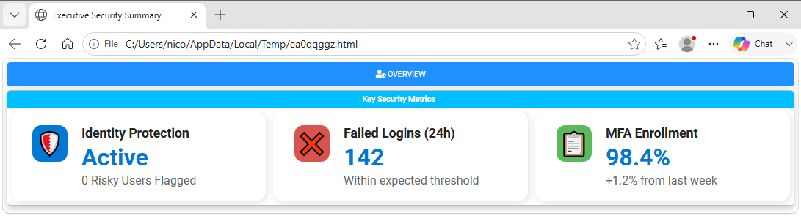

========================================================================
Chapter 8: Miscellaneous commandlets
========================================================================

.. contents:: Table of Contents
   :local:
   :depth: 2

Additional commandlets
=========================

In the past chapters, we explored the core functionalities of **PSWriteHTML** for creating interactive reports, dashboards, and visualizations. This
chapter introduces additional commandlets that enhance the module's capabilities, providing more flexibility and customization options for your HTML documents.

Using InfoCards with ``New-HTMLInfoCard``
----------------------------------------------

To display high-level KPIs, operational counters, or status summaries at the top of a dashboard, use
`New-HTMLInfoCard <https://github.com/EvotecIT/PSWriteHTML/blob/master/Docs/New-HTMLInfoCard.md>`_ . InfoCards support
icons (emojis, FontAwesome), custom colors, subtitle text, and distinct visual styles:

* **-Styles:** ``Standard``, ``Compact``, ``Fixed``, ``Classic``, ``NoIcon``.
* **-ShadowIntensity:** ``None``, ``Subtle``, ``Normal``, ``Bold``, ``ExtraBold``, ``Custom`` (with ``-CustomShadowColor``).
* **-Icon:** Icon to display on the card. Can be an emoji (like 👥, 🔒, 💪).
* **-IconSolid, -IconRegular, -IconBrands:** Use FontAwesome icons with different styles

.. code-block:: powershell

.. literalinclude:: sources/chapter-08-infocards.ps1
   :language: powershell

This is the result:

   Dashboard information cards displaying high-level operational metrics.

----

**Next Chapter:** :doc:`Chapter 9: Custom Styling, CSS, and Themes <chapter-09>`