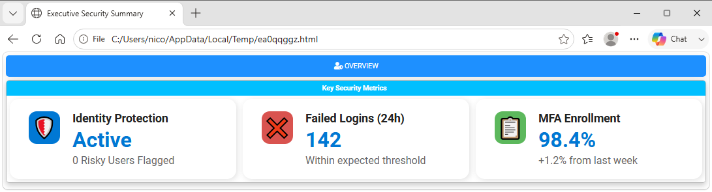
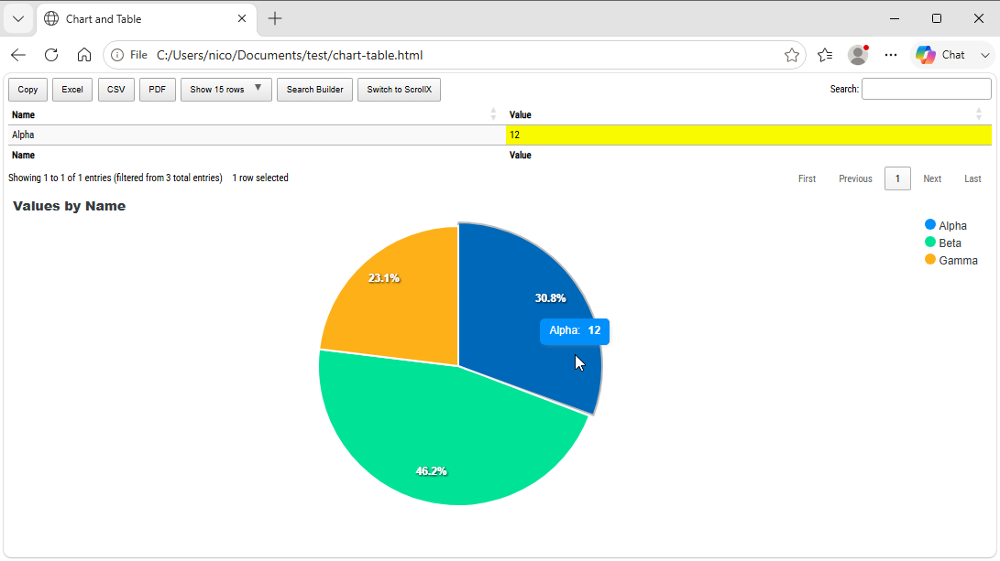

========================================================================
Chapter 11: Advanced Features, Layout Customization, and Troubleshooting
========================================================================

.. contents:: Table of Contents
   :local:
   :depth: 2

Advanced features Overview
==========================

As you scale **PSWriteHTML** across enterprise environments, building reports evolves beyond basic tables into crafting high-density,
visually appealing dashboards. 

This chapter covers modern UI components like **InfoCards**, dynamic layout density controls, advanced JavaScript/CSS customization,
performance tuning, and diagnostic troubleshooting.

Modern Dashboard Components & Styling
======================================

Key Metrics with ``New-HTMLInfoCard``
-------------------------------------

To display high-level KPIs, operational counters, or status summaries at the top of a dashboard, use
`New-HTMLInfoCard <https://github.com/EvotecIT/PSWriteHTML/blob/master/Docs/New-HTMLInfoCard.md>`_ . InfoCards support
icons (emojis, FontAwesome), custom colors, subtitle text, and distinct visual styles:

* **-Styles:** ``Standard``, ``Compact``, ``Fixed``, ``Classic``, ``NoIcon``.
* **-ShadowIntensity:** ``None``, ``Subtle``, ``Normal``, ``Bold``, ``ExtraBold``, ``Custom`` (with ``-CustomShadowColor``).
* **-Icon:** Icon to display on the card. Can be an emoji (like 👥, 🔒, 💪).
* **-IconSolid, -IconRegular, -IconBrands:** Use FontAwesome icons with different styles

.. code-block:: powershell

.. literalinclude:: sources/chapter-11-infocards.ps1
   :language: powershell

This is the result:

    Dashboard information cards displaying high-level operational metrics.

Controlling Layout Density with ``-Density``
--------------------------------------------

To handle responsive grid layouts without manually computing pixel widths or complex CSS flexbox rules, use the ``-Density`` parameter
on ``New-HTMLSection`` or ``New-HTMLPanel``. This automatically enables responsive wrapping and adjusts card/element margins:

* **``Spacious``:** Generous padding and whitespace; ideal for high-level executive summaries.
* **``Comfortable``:** Balanced spacing suited for standard multi-card layouts.
* **``Compact``:** Reduced margins for viewing dense telemetry datasets.
* **``Dense`` / ``VeryDense``:** Tight alignment maximizing screen real estate for NOC display walls.

.. code-block:: powershell

   New-HTMLSection -HeaderText "NOC Operations Grid" -Wrap wrap -Density VeryDense {
       # InfoCards or panels rendered here auto-wrap tightly to fit dense monitor setups
       foreach ($Metric in $NocMetrics) {
           New-HTMLInfoCard -Title $Metric.Name -Number $Metric.Value -Icon "server"
       }
   }

Advanced Scripting Patterns
===========================

Dynamic Component Loop Generation
---------------------------------

Instead of hardcoding every tab, section, or table, generate PSWriteHTML layout components dynamically using standard PowerShell
loops (``foreach``, ``for``).

.. code-block:: powershell

   $Servers = @('DC01', 'DC02', 'SQL01', 'WEB01')

   New-HTML -Title "Multi-Server Assessment" -FilePath "MultiServer.html" {
       foreach ($Server in $Servers) {
           New-HTMLTab -Name $Server -IconSolid "server" {
               New-HTMLSection -HeaderText "Diagnostic Summary for $Server" -Density Compact {
                   New-HTMLInfoCard -Title "Health" -Number "OK" -Icon "check-circle"
                   New-HTMLPanel {
                       New-HTMLText -Text "Detailed diagnostic metrics captured for node: <b>$Server</b>"
                   }
               }
           }
       }
   }

Embedding Raw Client-Side JavaScript
------------------------------------

Inject custom JavaScript directly into the document using the ``-UseJavaScriptLinks`` parameter
on `New-HTML <https://github.com/EvotecIT/PSWriteHTML/blob/master/Docs/New-HTML.md>`_  to handle bespoke interactions:

.. code-block:: powershell

   $ScriptBlock = @"
       document.addEventListener('DOMContentLoaded', function() {
           console.log('PSWriteHTML Dashboard Execution Initialized.');
       });
   "@

   New-HTML -Title "Custom Scripting" -FilePath "Scripting.html" -UseJavaScriptLinks $ScriptBlock {
       New-HTMLTab -Name "Main" {
           New-HTMLSection -HeaderText "Console Verification" {
               New-HTMLPanel {
                   New-HTMLText -Text "Open browser developer console (F12) to inspect client execution logs."
               }
           }
       }
   }

.. _correlating-tables-and-charts:

Correlating Tables and Charts with Events
-----------------------------------------

Interactive charts can be connected to a table so that selecting a chart value searches for and highlights the matching table rows.
This is implemented using `New-ChartEvent <https://github.com/EvotecIT/PSWriteHTML/blob/master/Docs/New-ChartEvent.md>`_  or
`New-DiagramEvent <https://github.com/EvotecIT/PSWriteHTML/blob/master/Docs/New-DiagramEvent.md>`_  cmdlets with
the ``-DataTableID`` parameter on ``New-HTMLTable`` and the ``-ID`` and ``-ColumnID`` parameters on the chart or diagram event.
The table must be rendered before the chart or diagram for proper correlation.

The parameters used to connect the components are:

* **``-ID``:** Identifies the target table when used with ``New-DiagramEvent``. It is also an alias for ``-TableID`` in
    ``New-TableEvent``.
* **``-ColumnID``:** Selects the zero-based table column used to match a chart or diagram event. The number follows the property
    order passed to ``-DataTable``, with the first property being column ``0``. For example, if the table is built
    from ``Select-Object Name, Status``, then ``Name`` is column ``0`` and ``Status`` is column ``1``.
* **``-DataTable``:** Supplies the objects or records that ``New-HTMLTable`` renders as rows.
* **``-DataTableID``:** Assigns a stable identifier to the table. Use the same value in ``New-ChartEvent`` or ``-ID`` on a related
    diagram/table event.
* **``-DataStore``:** Selects how ``New-HTMLTable`` provides its data to the page. The supported values are ``HTML`` (the
    default, renders the table data directly as HTML), ``JavaScript`` (embeds the data in the page as JavaScript and is required for
    browser-side chart or diagram correlation), and ``AjaxJSON`` (loads the data from a JSON endpoint for hosted/server-side tables).
    Use ``JavaScript`` for complex scenarios with client-side data; ``AjaxJSON`` requires a ``-FilePath`` on ``New-HTML`` and a web server that
    can serve the generated JSON data.

Give the table a stable identifier with ``-DataTableID`` and pass the same value to ``New-ChartEvent -DataTableID``. The
``-ColumnID`` parameter is zero-based and identifies the table column used for matching, so it must follow the order of the
properties supplied to ``-DataTable``. Table and diagram event commands also use ``-ID`` (an alias for the target table ID) and
``-ColumnID``. This event ID is separate from the chart's own ``-Id`` parameter.

Emit the table before the chart event consumer and
use ``-DataStore JavaScript`` when the chart should correlate with client-side table data. For a diagram, place
``New-DiagramEvent -ID $TableID -ColumnID 0`` inside ``New-HTMLDiagram``; ``-ID`` identifies the table and ``-ColumnID`` selects
the table column used by the diagram event.

The following example creates a pie chart and a table from the same data. Clicking a pie slice searches the first table column,
``Name``, because it is column ``0`` in the selected property order:

.. literalinclude:: sources/chapter-11-correlation.ps1
   :language: powershell

It produces the following interactive correlation:

    A chart and DataTable connected through an interactive correlation event.

You can also use  `New-TableEvent <https://github.com/EvotecIT/PSWriteHTML/blob/master/Docs/New-TableEvent.md>`_.
It listens for a row selection in one table and filters another table.

.. note::

    PSWriteHTML provides built-in events for chart-to-table, diagram-to-table, and
    table-to-table correlation through **New-ChartEvent**, **New-DiagramEvent**, and
    **New-TableEvent**. There is no built-in table-to-chart event. If you need to
    filter a chart based on table row selection, implement a custom JavaScript event
    handler using the ``-UseJavaScriptLinks`` parameter on ``New-HTML``.

Performance Optimization for Enterprise Scaling
===============================================

Generating reports with tens of thousands of records can impact initial creation time or browser responsiveness. Follow these tuning rules:

1. **Filter Data Upfront:**
   Select required properties *before* passing objects into ``New-HTMLTable``. Avoid passing raw, unfiltered WMI/CIM or Active Directory objects directly.

   .. code-block:: powershell

      # Bad: Passing raw AD objects with 100+ un-needed properties
      $Users = Get-ADUser -Filter * -Properties *

      # Good: Selecting target properties upfront
      $Users = Get-ADUser -Filter * -Properties DisplayName, Mail | Select-Object SamAccountName, DisplayName, Mail

2. **Balance Online vs. Offline Mode:**
   
   * Use **``-Online``** for live internal dashboards where client web endpoints have internet access. Web dependencies (Bootstrap,
     DataTables, ApexCharts) pull from fast CDNs, keeping output file sizes below 50 KB.
   * Use **``-Offline``** when deploying reports into air-gapped corporate subnets. Note that offline asset bundling increases file size.

3. **Limit DataTables Page Lengths:**
   Keep ``-PageLength 25`` or ``-PageLength 50`` on ``New-HTMLTable``. Defaulting page lengths to ``All`` forces client browsers to render
   thousands of dynamic DOM elements concurrently, causing tab freezing.

Troubleshooting Common Pitfalls
===============================

Issue 1: Empty Tables or Missing InfoCards
------------------------------------------

* **Symptom:** Page renders, but card sections or tables are completely blank.
* **Root Cause:** Variable supplied to ``-DataTable``, ``-Data``, or ``-Number`` is null or unpopulated.
* **Solution:** Add upfront data validation before building HTML containers:

  .. code-block:: powershell

     if ($null -eq $MyData -or $MyData.Count -eq 0) {
         Write-Warning "Data array empty. Rendering fallback card."
         $MyData = [PSCustomObject]@{ Status = "No Records Available"; Count = 0 }
     }

Issue 2: IIS 404 or Access Denied During Dashboard Update
---------------------------------------------------------

* **Symptom:** Scheduled task fails to overwrite ``index.html`` in ``C:\inetpub\wwwroot\``.
* **Root Cause:** The service account executing the PowerShell scheduled task lacks file Modify/Write permissions.
* **Solution:** Grant full folder permissions on the target web root to the execution user account or ``NT AUTHORITY\SYSTEM``.

Issue 3: Missing Icons in Air-Gapped Environments
-------------------------------------------------

* **Symptom:** FontAwesome icons or InfoCard symbols display as hollow square glyphs on internal servers.
* **Root Cause:** Report was generated with ``-Online``, but client browsers cannot reach CDN endpoints.
* **Solution:** Pass ``-Offline`` to ``New-HTML`` to bundle static local assets into the target path.

Diagnostic Checklist
====================

Verify this checklist when diagnosing reporting pipelines:

.. code-block:: text

   [ ] 1. Is PSWriteHTML up to date on the build host? (Update-Module PSWriteHTML -Force)
   [ ] 2. Does the target IIS folder permit Write actions for the Scheduled Task user?
   [ ] 3. Are layout density settings (-Density) applied to appropriate section levels?
   [ ] 4. Is the browser refresh meta header present for real-time NOC dashboards?
   [ ] 5. Are script blocks and curly braces balanced across all nested sections?
   [ ] 6. If emailing alerts: Is Email-HTML used instead of New-HTML?

----

**Next Chapter:** :doc:`Chapter 12: The Evotec PowerShell Module Suite <chapter-12>`
